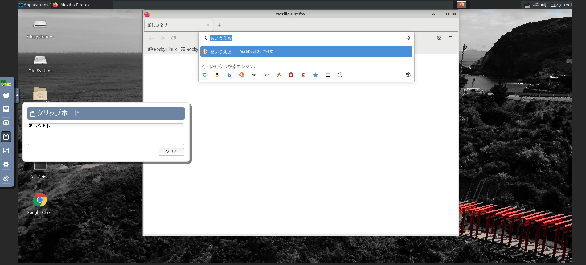
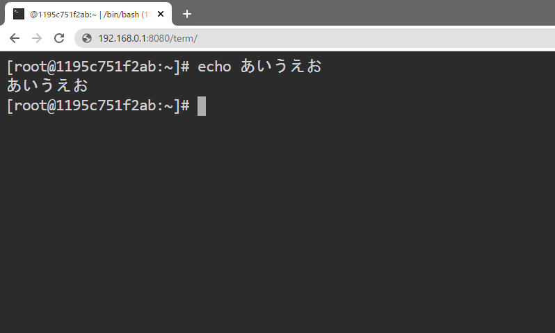

# Webブラウザ経由でLinuxデスクトップ環境が使える日本語向けコンテナイメージ (Rocky8ベース)

Linuxのデスクトップ環境(xfceを使用)をコンテナで起動でき、Webブラウザ経由でアクセスすることができます。
日本語向けにカスタマイズされており、デスクトップ環境はデフォルト言語が日本語に設定されています。
また、日本語入力変換も使えるようになっています。(Ctrl + Spaceで日本語入力ON/OFF切替)

# クイックスタート

- コンテナの起動 (rootユーザ利用時)

      docker run -d -it --name rocky8-desktop -p 8080:8080 -e PASSWORD="password" --shm-size=2g tmatsuo/rocky8-ja-desktop-min

- コンテナの起動 (一般ユーザ(user1)利用時)

      docker run -d -it --name rocky8-desktop -p 8080:8080 -e PASSWORD="password" -e USER=user1 --shm-size=2g tmatsuo/rocky8-ja-desktop-min

コンテナ起動後、数十秒待ってブラウザから https://サーバのIP:8080/desktop/ にアクセスしてください。  
Basic認証がかかっているため、以下アカウントでログインするとLinuxデスクトップ画面が表示されます。  
-it オプションを付けないと現状コンテナのログが出力されないのでご注意ください。

* ID : USER環境変数で指定したユーザ名
   * 未指定時はroot
* パスワード : PASSWORD環境変数で指定したパスワード
   * 未指定時はランダムなパスワードが生成されコンテナのログに出力されます。(ログ出力抑止も可能)

# イメージリスト

tmatsuo/rocky8-ja-desktop-min 以外に以下のイメージを用意しています。  
※ 一部イメージはデスクトップ環境が入っておらず、本リポジトリから生成された派生イメージです。

|イメージ名                                |web desktop(xfce)|firefox|chrome|web filer|web terminal|remote desktop|vscode(web)|sshd|
|:----------------------------------------:|:---------------:|:-----:|:----:|:-------:|:----------:|:------------:|:---------:|:--:|
|tmatsuo/rocky8-ja-desktop-min             |✓                |✓      |      |         |            |              |           |    |
|tmatsuo/rocky8-ja-desktop-with-filer      |✓                |✓      |      |✓        |            |              |           |    |
|tmatsuo/rocky8-ja-desktop-with-term-filer |✓                |✓      |      |✓        |✓           |              |           |    |
|tmatsuo/rocky8-ja-desktop-ful             |✓                |✓      |✓     |✓        |✓           |✓             |✓          |✓   |
|tmatsuo/rocky8-ja-xrdp                    |                 |       |      |         |            |✓             |           |    |
|tmatsuo/rocky8-ja-term-with-filer         |                 |       |      |✓        |✓           |              |           |    |


# ビルド方法

```
# ./build.sh
```
=> デフォルトで、tmatsuo/rocky8-ja-desktop-ful イメージが生成されます。

```
# FLAVOR=desktop-min ./build.sh
```
=> tmatsuo/rocky8-ja-desktop-min イメージが生成されます。

※ビルドにはBuildKitを使用しています。動作確認はDocker 20.10を使用しています。

# 解説

デフォルトでSSLが有効になっており、PAMベースのBasic認証がかかっています。
Linuxデスクトップ以外に、ターミナルエミュレータ(ブラウザでアクセス可)、sshサーバ、RDPサーバ、ファイルブラウザアプリ等が搭載されています。
使っている主なコンポーネントは以下の通りです。

* [**Xfce4**](http://www.xfce.org) - Linuxデスクトップマネージャ。
* [**noVNC**](https://github.com/novnc/noVNC) - HTML5 VNCクライアント。上記Linuxデスクトップ(xfce)へのアクセス用です。
   * http(s)://IP:Port/desktop/ というパスでアクセスできます。(IP:Portはコンテナの待ち受けIPとPort)
* [**ttyd**](https://github.com/tsl0922/ttyd) - ブラウザ上で利用できるターミナルエミュレータ。
   * http(s)://IP:Port/term/ というパスでアクセスできます。(IP:Portはコンテナの待ち受けIPとPort)
* [**filebrowser**](https://github.com/filebrowser/filebrowser) - ファイルブラウザ。手元の端末からファイルをアップロード・ダウンロード可能。
   * http(s)://IP:Port/file/ というパスでアクセスできます。(IP:Portはコンテナの待ち受けIPとPort)
* [**Code Server**](https://github.com/cdr/code-server) - Webブラウザ経由でアクセスできるVSCode
   * http(s)://IP:Port/code/ というパスでアクセスできます。(IP:Portはコンテナの待ち受けIPとPort)
* [**Nginx**](https://github.com/nginx/nginx) - Webサーバ
   * 上記アプリへのリバースプロキシとして動いています。
* [**Supervisord**](http://supervisord.org/) - プロセス制御システム
   * 上記のコンポーネントは、supervisord を使って起動されます。
* [**xrdp**](https://github.com/neutrinolabs/xrdp) - リモートデスクトップサーバ。VNCと同じ画面にRDPプロトコルを使って接続できます。ブラウザ経由ではアクセスできません。
   * コンテナ起動時に3389ポートを公開する必要があります。
* **sshd** - SSHサーバ。ブラウザ経由ではアクセスできません。
   * コンテナ起動時に22ポートを公開する必要があります。

対応ブラウザ

* Firefox
* Chromium
* Edge

その他特徴

* 通信経路にプロキシがいるような環境で、無通信のセッションが強制的に切断されないように、デスクトップ環境はKeepaliveパケットを定期的に送信します。
* Linuxデスクトップおよびターミナルエミュレータは、ブラウザ閉じる場合に警告を出します。これによって、誤ってブラウザが閉じられるのを防ぐことができます。
* デスクトップ環境はブラウザ画面内の右上に表示されます。クリップボート画面を画面内で任意の箇所に移動できるため、クリップボードを開いたままでも邪魔になりません。
  
画面例

Webブラウザ上でのLinuxデスクトップ



ターミナルエミュレータ



## 環境変数

### 待ち受けポート

* PORT, デフォルト: `8080`
  * コンテナ(Nginxリバースプロキシ)の待ち受けポートを指定できます。
* SSH_PORT, デフォルト: `22`
  * SSHサーバの待ち受けポートを指定できます。
* RDP_PORT, デフォルト: `3389`
  * リモートデスクトップサーバの待ち受けポートを指定できます。

### ユーザ関連

* USER, デフォルト: `root`
  * デスクトップやターミナル等の全サービスが指定されたユーザ権限で起動されます。
  * root以外の一般ユーザを指定することでセキュリティ向上が見込めます。
* USER_ID, デフォルト: `1000`
  * 上記 USER の UID を指定できます。
* ENABLE_SUDO, デフォルト: `false`
  * 上記 USER が sudo を実行できるようになります。
* PASSWORD, デフォルト: `(未設定)`
  * メインユーザ(デフォルトroot)のパスワード。デフォルトはランダム設定でコンテナログに出力されます。
* ROOT_PASSWORD, デフォルト: `(未設定)`
  * rooユーザのパスワード。USERでroot以外のユーザを指定した時のみ有効です。デフォルトはランダムなパスワードが設定され、コンテナログに出力されます

### フック関連

* PRE_HOOK PRE_HOOK_ONCE POST_HOOK_ONCE POST_HOOK, デフォルト: `(未設定)`
  * コンテナ起動時に任意のシェルスクリプトを実行することができます。スクリプトをコンテナにボリュームマウントし、そのマウントパスを環境変数に指定してください。
  * スクリプトは source コマンドで読み込まれます。不要な環境変数はスクリプト内でunsetしてください。
  * スクリプトのリターンコードが0以外の場合、処理はそこで中断します。(コンテナ起動に失敗します)
  * PRE_HOOK -> PRE_HOOK_ONCE -> コンテナ初期起動時に1回だけ実行される処理 -> POST_HOOK_ONCE -> POST_HOOK -> コンテナメインプロセス(supervisord) の順番で実行されます。
  * PRE_HOOK_ONCE と POST_HOOK_ONCE はコンテナを初めて起動する時に1回しか実行されません。

### デスクトップ環境(VNC)関連

コンテナ起動時に以下の環境変数を指定することができます。

* VNC_COL_DEPTH, デフォルト: `16`
  * 色深度を指定できます。
* VNC_RESOLUTION, デフォルト: `1800x850`
  * デスクトップの解像度を指定できます。横解像度x縦解像度 というフォーマットで記載してください。
  * コンテナ起動後に解像度を変更したい場合は、Linuxデスクトップの設定で変更することができますが、コンテナを再起動すると元に戻ります。設定を永続化したい場合は、set-resolutionコマンドで変更できます。
     * (例) `set-resolution 1280x1024`

### SSH関連

* SSH_KEY, デフォルト: 未指定
  * SSHログイン用の公開キーを設定できます。

### TTYD関連

* TTYD_OPTS, デフォルト: `-P 30`
  * ターミナル(ttyd)のオプションを指定できます。デフォルトで設定されている-Pオプションはキープアライブパケットの送信間隔です。
  * 上記オプションに加え、`-p 57575 -i lo -b /term/ /bin/bash` というオプションを用いてttydが起動されます。

### VSCode関連

* CODE_OPTS, デフォルト: `--auth none`
  * VSCode(code-server)起動時の追加オプションを指定します。(拡張パッケージインストールオプション--install-extensionは指定不可)

### サービス無効化・削除

* DISABLE_DESKTOP / DELETE_DESKTOP, デフォルト: 未指定
  * trueを設定すると、Linuxデスクトップ環境を無効化(自動起動OFF)/サービス削除します。
  * 本オプションを指定した場合、リモートデスクトップも無効化されます。
* DISABLE_TERMINAL / DELETE_TERMINAL, デフォルト: 未指定
  * trueを設定すると、ターミナルを無効化(自動起動OFF)/サービス削除します。
* DISABLE_FILER / DELETE_FILER, デフォルト: 未指定
  * trueを設定すると、ファイルブラウザを無効化(自動起動OFF)/サービス削除します。
* DISABLE_SSH / DELETE_SSH, デフォルト: 未指定
  * trueを設定すると、SSHサーバを無効化(自動起動OFF)/サービス削除します。
* DISABLE_RDP / DELETE_RDP, デフォルト: 未指定
  * trueを設定すると、RDPサーバを無効化(自動起動OFF)/サービス削除します。
* DISABLE_CODE / DELETE_CODE, デフォルト: 未指定
  * trueを設定すると、VSCode (code-server)を無効化(自動起動OFF)/サービス削除します。
* DISABLE_SSH_PASSWORD_LOGIN, デフォルト: 未指定
  * trueを設定すると、SSHのパスワードログインを無効にします。

## コピペについて

* Webブラウザ上のLinuxデスクトップ内は、通常のLinuxデスクトップ環境と同じように、文字列選択でコピー、マウス中クリックでペースト可能です。
  * Linuxデスクトップとブラウザ実行端末間でのコピペは、VNCのツール(画面左)を使ってください。
* ターミナルエミュレータの文字は、文字列選択でコピー可能です。ペーストは Shift + Insert や Ctrl + Shift + v で可能です。(ブラウザ依存)

## その他

一部ショートカットがホスト側のWebブラウザで補足されてしまいますが、Webブラウザを全画面表示することで
ある程度回避可能です。

